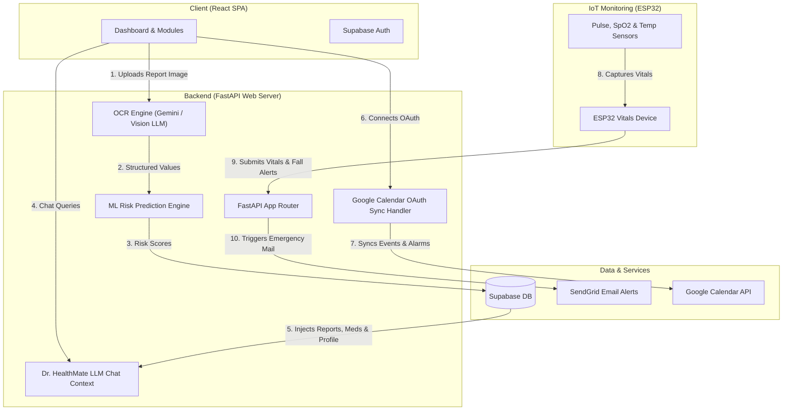

# 🩺 HealthMate AI
### Generative AI-Powered Preventive Healthcare & IoT Monitoring Assistant

[](https://ai-healthmate.netlify.app)
[](https://healthmate-api-2qu0.onrender.com)
[](https://ai-healthmate.netlify.app)
[](https://supabase.com)

**HealthMate AI** is a comprehensive, preventive healthcare platform. It bridges the gap between medical diagnostics, patient understanding, and real-time care. By combining OCR document extraction, machine learning predictive models, Generative AI diagnostics, automated Google Calendar schedules, and live IoT hardware alerts, it acts as a personal 24/7 health guardian.

---

## 💡 The Problem

Medical reports are packed with complex clinical terms, reference ranges, and raw numbers (e.g., RBC, glucose, lipid counts) that the average patient cannot easily interpret:
* **The Clinical Gap:** Raw metrics are provided without clear, plain-language explanations.
* **Early Warning Misses:** Minor elevations in critical biomarkers often go unnoticed until they become chronic conditions.
* **Disconnected Systems:** Medical data, daily medicine intake schedules, symptom reporting, and wearable vitals are siloed instead of working together.

## 🛡️ The Solution

HealthMate AI connects these modules into a single, cohesive health ecosystem:

* 📊 **OCR Parsing:** Extracts medical parameters from uploaded lab report images.
* 🧠 **ML Risk Prediction:** Calculates personalized risk probabilities for diabetes, cardiovascular issues, and other conditions.
* 🗣️ **GenAI Narrative:** Translates raw lab diagnostics into human-friendly explanations.
* 📅 **Google Calendar Sync:** Sets up medication schedules and alarms directly on the patient's phone/calendar.
* 📡 **IoT Hardware Integration:** Monitors body vitals in real-time and alerts caregivers instantly in case of emergencies (like falls or vital drops).

---

## 🏗️ System Architecture



---

## 🌟 Key Features

### 1. 📊 Medical Report OCR & ML Risk Prediction
* **Vision OCR:** Extracts CBC, lipid profiles, thyroid parameters, glucose, and other key medical values from physical report uploads.
* **Risk Engine:** Passes values to a trained Machine Learning model to calculate risks for diabetes, heart conditions, liver issues, etc.
* **Generative Explanation:** Explains exactly what each number means, the severity of the flags, and practical precautions.

### 2. 🤖 Dr. HealthMate AI Chat Companion
* **Context Injected:** The AI companion is automatically fed with your health history, latest parsed reports, current active medications, and registered profile.
* **Human-in-the-Loop Dialogues:** Enables the user to ask follow-up questions, describe symptoms, and get conversational medical feedback.

### 3. 📅 Medicine Scheduler & Direct Google Calendar Sync
* **Full CRUD Scheduling:** Input medications, starting/ending dates, frequencies, and specific times.
* **Google OAuth2 Sync:** Links directly to your Google Account. It automatically syncs schedules onto your personal calendar with 0-minute popup alarms.
* **Background Sync:** Syncs existing or offline medicines in one click without redirecting to authorization logins.
* **Clean Removal:** Deleting a medicine in the app automatically wipes the event from your Google Calendar.

### 4. 📡 Live Wearable Vitals & Caregiver Alerts (IoT)
* **ESP32 Integration:** Receives body temperature, steps, SpO2, and heart rate data from an ESP32 micro-controller board.
* **Critical Alerts:** If vitals drop below safety limits or if **Fall Detection** is triggered, it instantly logs an alert in the database.
* **Caregiver Notification:** Automatically sends emergency email alerts using SendGrid to the patient and their caregiver.

---

## 🛠️ Tech Stack

### Frontend
* **Core:** React, TypeScript, Vite
* **Styling:** Tailwind CSS, Framer Motion (for animations), Lucide React (for icons)
* **Auth & Session:** Supabase JS SDK

### Backend
* **Server:** FastAPI (Python), Uvicorn (ASGI web server)
* **APIs & Frameworks:** PyJWT (Token verification), Requests (HTTP calls)
* **AI & OCR:** Gemini API / OpenRouter Vision Model pipelines

### Database & Integration
* **Database:** Supabase (Postgres)
* **Authentication:** Supabase GoTrue Auth
* **APIs:** Google Calendar API, SendGrid Mail API

---

## ⚙️ Installation & Setup

### 1. Database Migration
Run this setup SQL in your **Supabase SQL Editor** to initialize the required tables, schemas, Row Level Security (RLS) policies, and relationships:

```sql
-- 1. Medicines table
CREATE TABLE IF NOT EXISTS medicines (
  id UUID DEFAULT gen_random_uuid() PRIMARY KEY,
  user_id UUID REFERENCES auth.users(id) ON DELETE CASCADE NOT NULL,
  medicine_name TEXT NOT NULL,
  dosage TEXT NOT NULL,
  doses_per_day INTEGER DEFAULT 1,
  times TEXT[] NOT NULL,
  start_date DATE,
  end_date DATE,
  frequency TEXT DEFAULT 'daily',
  every_hours INTEGER,
  is_active BOOLEAN DEFAULT true,
  google_event_ids TEXT[] DEFAULT '{}',
  created_at TIMESTAMPTZ DEFAULT now()
);

-- 2. Medicine logs table (for streak tracking)
CREATE TABLE IF NOT EXISTS medicine_logs (
  id UUID DEFAULT gen_random_uuid() PRIMARY KEY,
  medicine_id UUID REFERENCES medicines(id) ON DELETE CASCADE NOT NULL,
  user_id UUID REFERENCES auth.users(id) ON DELETE CASCADE NOT NULL,
  taken_at TIMESTAMPTZ DEFAULT now(),
  scheduled_time TEXT NOT NULL
);

-- 3. Google tokens table
CREATE TABLE IF NOT EXISTS user_google_tokens (
  user_id UUID PRIMARY KEY REFERENCES auth.users(id) ON DELETE CASCADE,
  access_token TEXT NOT NULL,
  refresh_token TEXT NOT NULL,
  expires_at TIMESTAMPTZ NOT NULL,
  created_at TIMESTAMPTZ DEFAULT now()
);

-- Enable RLS Policies
ALTER TABLE medicines ENABLE ROW LEVEL SECURITY;
ALTER TABLE medicine_logs ENABLE ROW LEVEL SECURITY;
ALTER TABLE user_google_tokens ENABLE ROW LEVEL SECURITY;

CREATE POLICY "Users can manage own medicines" ON medicines FOR ALL USING (auth.uid() = user_id);
CREATE POLICY "Users can manage own medicine logs" ON medicine_logs FOR ALL USING (auth.uid() = user_id);
CREATE POLICY "Users can manage own Google tokens" ON user_google_tokens FOR ALL USING (auth.uid() = user_id);
```

### 2. Backend Configuration
Create a `.env` file in the `backend` folder:
```env
SUPABASE_PROJECT_ID=your_supabase_project_id
SUPABASE_JWT_ISSUER=https://your_supabase_project_id.supabase.co/auth/v1
SUPABASE_ANON_KEY=your_supabase_anon_key
SUPABASE_SERVICE_ROLE_KEY=your_supabase_service_role_key

OPENROUTER_API_KEY=your_openrouter_api_key
GEMINI_API_KEY=your_gemini_api_key

# Google Calendar OAuth Credentials
GOOGLE_CLIENT_ID=your_google_client_id.apps.googleusercontent.com
GOOGLE_CLIENT_SECRET=your_google_client_secret
GOOGLE_REDIRECT_URI=http://localhost:5173/google-callback

# Caregiver Alerts
SENDGRID_API_KEY=your_sendgrid_api_key
SENDGRID_FROM_EMAIL=your_verified_sendgrid_email
```

### 3. Running Locally

#### Run Backend (FastAPI):
```bash
cd backend
python -m venv .venv
source .venv/bin/activate  # On Windows: .venv\Scripts\activate
pip install -r requirements.txt
uvicorn app.main:app --reload
```

#### Run Frontend (Vite):
```bash
cd frontend
npm install
npm run dev
```

---

## 📈 Future Scope
* **PWA & Offline Logging:** Service workers to cache schedule data locally so users can track medicine intake without internet access.
* **Unified Health Dashboard Timeline:** Redesigning the home screen to show a unified timeline combining vitals updates, logged symptoms, and scheduled doses in a chronological log.
* **Caregiver Remote Dashboard:** Dedicated interface for family members/doctors to monitor real-time safety scores and vitals trends.
